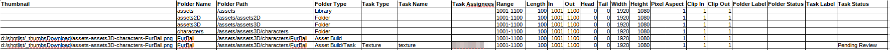

# Get Shot List

Pulls Spreadsheet containing folder and task info from Ayon database.

Downloads thumbnails from Ayon. Note that Ayon user has to have admin rights to be able to download the thumbnails.

The absolute path to downloaded thumbnails is stored in csv.

For LibreOffice users, there is an addon to swap path to image to image:
https://extensions.libreoffice.org/en/extensions/show/links-to-images

